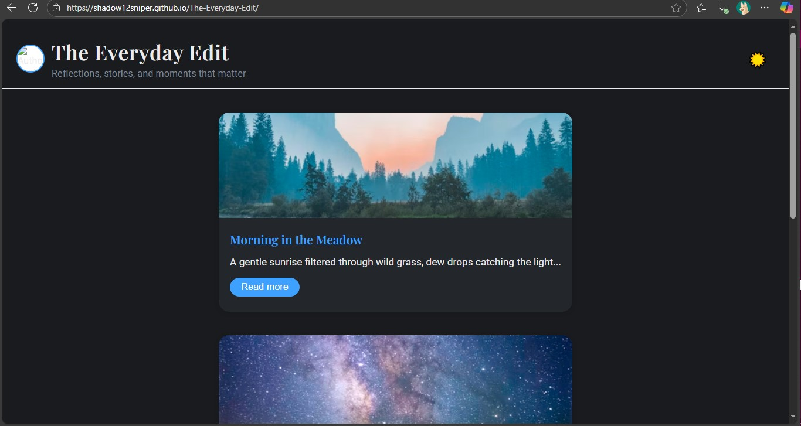

# [The Everyday Edit] – Responsive Blog Template

A minimal, elegant blog layout built with semantic **HTML5**, **CSS3**, and **JavaScript**.

## 🚀 Features
- Responsive grid‑based blog layout
- “Read more” toggle for posts
- Dark mode toggle with CSS variables
- Footer with clickable social media icons

## 🛠 Tech Stack
- HTML5  
- CSS3 (CSS Variables)  
- JavaScript (ES6+)  

## 📸 Screenshots

## 🔗 Live Demo
[View Live Site](https://shadow12sniper.github.io/The-Everyday-Edit/)

## 📂 How to Use
1. Clone the repo:  
   `git clone https://github.com/shadow12sniper/blog-template.git`
2. Open `index.html` in your browser.

---
